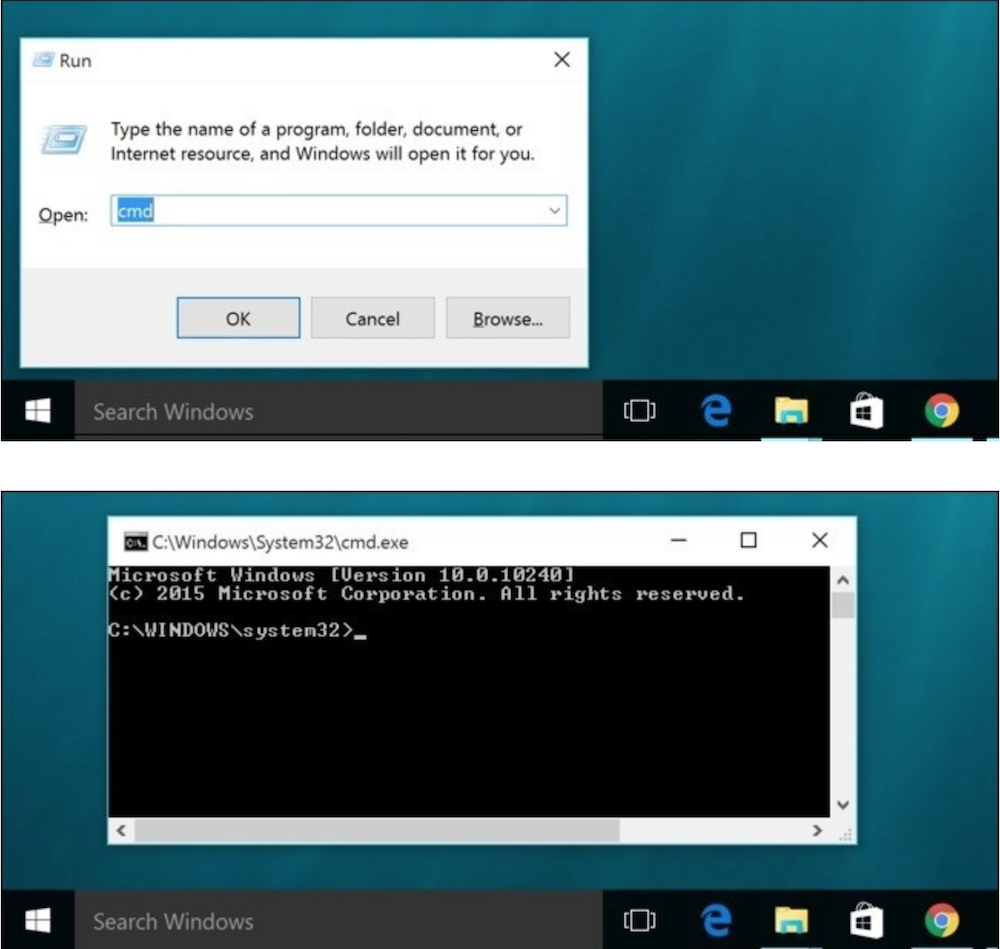
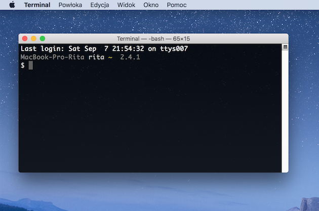

By zacząć pisać kod w języku Python, nie potrzeba wiele.  
Na początek wystarczy przeglądarka internetowa i edytor tekstu – a najlepiej jeden z edytorów kodu stworzonych z myślą o programistach.  
W kolejnych krokach przyda się także zainstalowany Python i umiejętność korzystania z terminala (czyli okna, w którym wpisujemy komendy).

---

## Edytor tekstu

To narzędzie, w którym będziemy pisać kod.

Możesz zacząć nawet od prostego Notatnika (Windows) czy TextEdit (Mac), ale zdecydowanie polecamy zainstalowanie:

👉 **[Visual Studio Code (VS Code)](https://code.visualstudio.com/)**  
To darmowy, lekki edytor kodu z podpowiedziami, kolorowaniem składni i mnóstwem dodatków, które pomogą Ci pisać lepszy kod szybciej.

---

## Konsola / Terminal

Na początku będziemy korzystać z **konsoli**, **terminala**, **wiersza poleceń** lub **linii poleceń** – wszystkie te określenia oznaczają to samo: okno na komputerze, w którym można wpisywać polecenia, które komputer wykona.

To przydatne narzędzie, które pozwala uruchamiać programy, sprawdzać pliki i korzystać z Pythona w wersji "tekstowej".

---

## Jak otworzyć terminal?

### 🪟 Windows

W zależności od wersji systemu Windows jedna z poniższych metod powinna zadziałać:

- Przejdź do menu Start i wpisz `cmd` lub `Wiersz poleceń`
- Skrót: naciśnij klawisz **Windows** + **R**, wpisz `cmd`, naciśnij **Enter**
- Menu Start → Wszystkie programy → Akcesoria → Wiersz poleceń

{:title="Wiersz poleceń Windows 10" class="img-responsive"}

---

### 🍎 macOS

Aby otworzyć **Terminal**:

- Naciśnij jednocześnie **cmd ⌘ + spacja** i wpisz `Terminal`, potem naciśnij **Enter**
- Albo: Applications → Utilities → Terminal

{:title="Terminal MacOS" class="img-responsive"}

📝 Kolor terminala możesz zmienić w lewym górnym rogu w zakładce *Preferences* → *Profiles*

---

### 🐧 Linux

U użytkowników Linuxa terminal zwykle znajduje się w:

- Applications → Accessories → Terminal  
- Applications → System → Terminal

Jeśli nie możesz znaleźć terminala – skorzystaj z wyszukiwarki lub wpisz `terminal` w menu startowym swojej dystrybucji.

---

## Instalacja Pythona 🐍

Zanim zaczniemy kodować – musimy upewnić się, że Python jest zainstalowany na Twoim komputerze.

### Sprawdzenie, czy Python już jest:

W terminalu wpisz:

```
python --version
```
albo

```
python3 --version
```
Jeśli zobaczysz coś takiego:

```
Python 3.12.3
```
– to znaczy, że wszystko działa! 🎉
